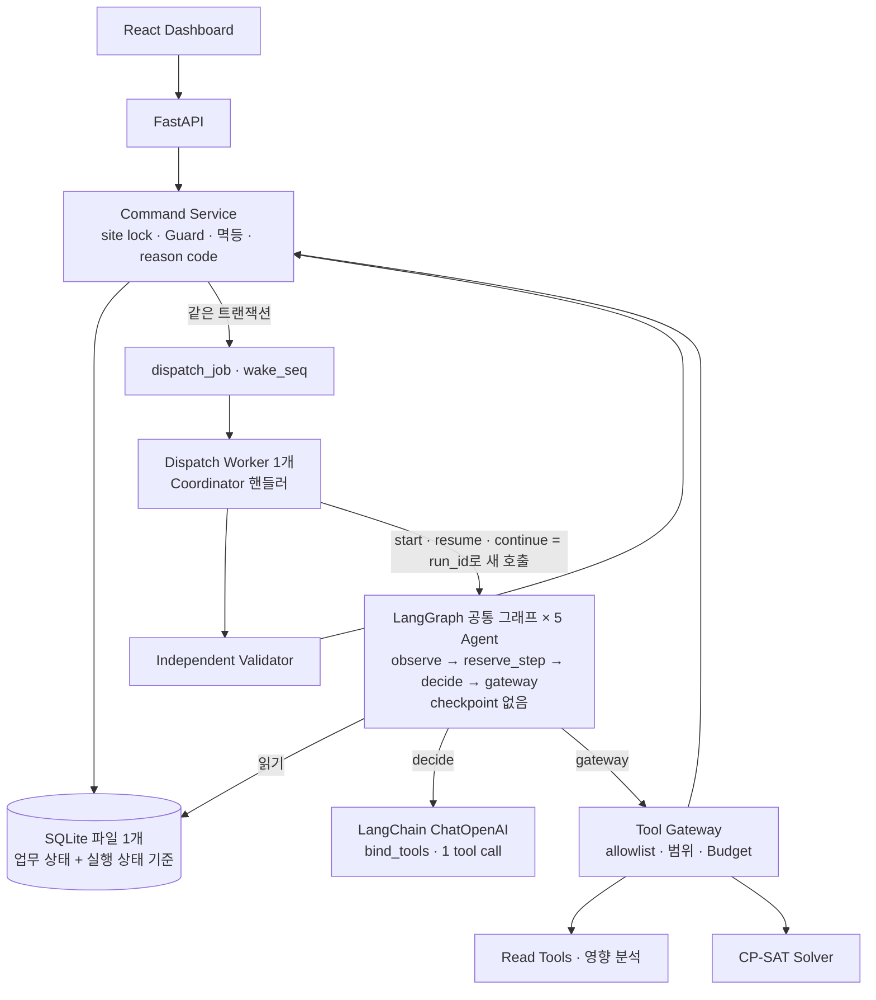
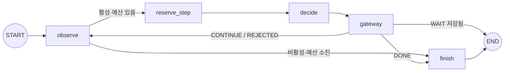

# SAFE-ORCH Project Blueprint v1.2.3

**Safety-Constrained Agentic Orchestration System**  
버전: 1.2.3 · 작성일: 2026-09-24 · 문서 성격: MVP 구현 기준 설계

v1.2.2에 `SAFE-ORCH_v1.2.3_Review_2026-09-24`의 판단을 반영한 구현 기준 문서다. 저장소를 **SQLite 하나**로 바꾸고, LangGraph는 **checkpoint·interrupt 없이** 실행 흐름에만 쓴다. 대기·재개·미완료 step 계약을 보강했다. 문제 정의, 핵심 업무 흐름, 안전·권한 계약, Agent 우선순위는 그대로다. v1.2.2는 보존한다. 조선소는 시연용 Domain Pack일 뿐이며 코어는 특정 산업에 한정되지 않는다.

```text
LLM may propose.  Solver may optimize.  Safety Kernel must validate.  Human must authorize.
```

---

## 1. 정의와 범위

**한 줄 정의.** 여러 작업 주체가 공간·장비·시간을 공유하는 현장에서, 다섯 AI Agent가 작업 접수·재계획·담당자 협의·지연 신고 대응·질의 지원을 나눠 맡아 사람이 전화·회의·엑셀로 하던 조정 업무를 대신 처리한다. 안전 제약은 결정론적 검증기가 검증하고, 최종 확정은 사람이 한다.

**문제.** 계획은 주체별로 따로 세우지만 계획 간 겹침(인양 하부 작업, 화기 인접 도장, 장비 이중 배정)은 사람이 조정한다. 그래서 충돌을 늦게 발견하고, 조정안이 경험에 의존하며, 현장이 바뀌어도 이미 승인된 계획이 그대로 쓰일 위험이 있다.

| 역할 | 하는 일 | 권한 근거 |
|---|---|---|
| Unit Planner | 작업 요청, Agent 질문에 답변 | Actor.roles |
| Task Owner (작업 담당자) | 자기 작업의 변경 요청에 수용·이견, 이동 가능 여부 확인 | `task.owner_actor_id` (별도 역할 없음) |
| Reporter (현장 신고자) | 지연 신고, 되묻기에 답변 | Actor.roles |
| Site Supervisor | 후보 승인·거절, 사실 확인, Hold 해제, 미응답 수용 | Actor.roles |

**범용성.** 코어는 Task·WorkUnit·Resource·Zone·ZoneRelation·Rule만 안다. 산업별 차이(작업 유형, 위험 태그, 구역 관계, Rule 파라미터, fixture)는 **Domain Pack** YAML로 표현한다. 예: 조선소(시연), 건설, 스마트팩토리, 플랜트 정비, 물류.

**의미의 한계.**
- `PASS`는 확인된 입력과 현재 Pack Rule 기준으로 정의된 제약 위반이 없다는 뜻이다. 현장 안전 보장이나 법규 판정이 아니고, Rule 수치는 데모 정책이다.
- "최적"은 **해당 SearchSpec의 허용 범위 안에서**의 최적이다. 더 넓은 범위나 확인되지 않은 대체 자원까지 포함한 전역 최적이 아니다.
- 협의는 작업 담당자 동의와 관련 주체 통지까지다. 여러 업체의 작업을 동시에 협상하는 기능이 아니다.

**효율 목표.** Hard 제약을 지키면서 변경 작업 수를 먼저, 총 지연을 그다음으로 최소화한다. 사람에게는 조회로 알 수 없는 것만 묻는다.

---

## 2. 핵심 기능과 E2E 흐름

| ID | 기능 | 담당 |
|---|---|---|
| F1 | 작업계획 접수: 조회·확인으로 확정 TaskSpec 생성 | (Site Assistant →) Work Intake Agent |
| F2 | 충돌 탐지·재계획: 전략 선택 → CP-SAT → 관찰 → 전략 변경, 필요한 확인 직접 요청 | Rule Engine + Replanning Agent |
| F3 | 담당자 협의·관련 주체 통지: 동의 수집, 이견을 구조화 제약으로 정리, 확정 후 조치 통지 | Coordination Agent |
| F4 | 지연 신고 대응: 즉시 Hold, 대상·영향 파악, 필요 시 되묻기, 사실 수정안 작성 | Hold Policy + Event Response Agent |
| F5 | 독립 검증 + 사람 승인: PASS·최신 버전·Hold 없음·협의 완료일 때만 확정 | Validator + Supervisor |

```text
요청 → (Assistant Handoff) → Intake(조회 → 확인) → READY
 → 충돌 탐지 → Replanning(전략 → Solver → 관찰 → 전략 변경 / 담당자에게 이동 가능 여부 질문)
 → Candidate → Validator PASS → Consultation 생성(서버 계산)
 → Coordination: 협의 필요 항목에 변경 요청
      ├ 이견 → 제약 초안 → 이견 낸 담당자 확인 → Context 증가 → Replanning 재탐색
      └ 협의 완료 → Supervisor 승인·확정 → Plan R(n+1) → Coordination 통지
 → 지연 신고 → 즉시 Hold → Event Response(조회 → 영향 분석 → 되묻기) → 사실 수정안
      → Supervisor 확인 · Hold 해제 → 재검사(충돌 유무와 관계없이 재확정 후보 생성)
```

---

## 3. Architecture



| 구성요소 | 역할 |
|---|---|
| Command Service + Guard | 모든 상태 변경의 유일한 경로. site lock(SQLite 쓰기 트랜잭션, §5.4), 권한, 버전, Hold, 협의 상태, 멱등 키 검사. 후속 작업·wake를 같은 트랜잭션에서 기록 |
| Coordinator (dispatch 핸들러) | 도메인 사실을 보고 다음 필수 단계와 담당 Agent Run의 시작·재개·종료를 결정. Handoff 전달 |
| LangGraph 공통 그래프 | 한 번의 호출 안에서 관찰·step 예약·선택·도구 반복과 분기. 대기하면 호출이 끝나고, 재개는 같은 Run의 새 호출. 실행 상태는 SQLite의 AgentRun·AgentStep |
| LangChain | 모델 호출, 메시지, Action 스키마 바인딩과 tool call 파싱 |
| Event/Hold Policy | 접수 transaction에서 Agent보다 먼저 Hold 적용 |
| Rule Engine / Validator | 충돌 탐지 / Candidate 전체 계획 검사 (Solver와 코드 분리, 그래프 밖) |
| CP-SAT Solver | 서버가 만든 SearchSpec으로 계산 (lock 밖, 결과 등록은 lock 안) |
| Tool Gateway | Agent의 유일한 도구 실행 경로. Action allowlist, 파라미터, 범위, Budget 검사 |

상세 경계는 §11.1에 있다.

### 3.1 Agent 구성

모든 Agent는 Goal을 갖고, 상태·Tool 결과·사람 응답을 관찰하며, 허용된 Action 중 다음 행동을 고르고, 결과를 다시 관찰해 전략을 유지하거나 바꾸는 것을 Goal 달성·이관·Budget 소진까지 반복한다. 단일 LLM 호출이나 고정 질문지는 Agent로 세지 않는다. **구현 수준이 이 조건에 못 미치면 Agent라고 주장하지 않는다.**

| 우선 | Agent | Goal | 할 수 없는 것 |
|---|---|---|---|
| P0 | Replanning | 검증 가능한 최소 변경 대안 | Hard 제약 완화, 타 Unit 작업·SearchSpec 밖 축 변경 |
| P0 | Coordination | 협의 항목 해소, 확정 후 통지 | 협의 완료 선언(서버가 계산), 이견을 확인 없이 제약화 |
| P0 | Work Intake | 확인된 TaskSpec | 추정값 CONFIRMED 처리 |
| P1 | Event Response | 지연 신고의 대상·영향·사실 수정안 | Hold 해제·축소, 사실 직접 적용 |
| P2 | Site Assistant | 근거 있는 답변, 요청 연결 | 승인·확정·해제 대행 |

Hold 자체는 P0 결정론 기능이다. Site Assistant는 연결(Handoff)을 먼저 구현하고 Q&A는 마지막에 붙인다.

Agent끼리 직접 통신하지 않는다. 연결은 Coordinator를 거친 typed object(Handoff, Candidate, Proposal, Message)로만 한다. **Agent가 발품(조회·계산·질문·정리·연락)을 팔고, 사람이 결정하고, 결정론 계층이 권한을 쥔다.**

### 3.2 권한 경계

- Tool Gateway에는 승인·거절·확정·Hold 해제·Proposal 확인·미응답 수용·Validation 등록 함수가 **코드상 없다.**
- 프레임워크에 전달되는 값(그래프 입력, 그래프 상태, 모델 출력)은 권한이 아니다. 그래프 입력은 `run_id`뿐이고, 그래프는 DB를 읽기만 하며, 쓰기는 `reserve_step`·Gateway → Command Service로만 한다.
- 사람 API는 데모 인증(`X-Actor` + 서버 Actor 테이블)으로 역할과 담당 관계를 확인하고, 본문의 `role`·`approved` 같은 필드는 무시한다.
- **읽기 정책(MVP):** site의 Actor는 site 정보를 모두 볼 수 있다. 제한은 행동(자원 사용 `allowed_unit_ids`, 명령 권한)에만 둔다. 정보 비공개 경계는 구현하지 않으며 "존재 자체 미노출"을 주장하지 않는다.
- 단일 프로세스(API + dispatch 워커 스레드 1개)이며 권한별 DB 자격증명 분리는 하지 않는다(한계로 명시). 워커 배타성은 §11.4.

---

## 4. 핵심 Invariant

| ID | 조건 |
|---|---|
| I-01 | Agent는 Validation, 승인, 거절, 확정, Hold 해제, Proposal 확인, 미응답 수용을 할 수 없다 |
| I-02 | 모든 상태 변경 명령은 site lock(SQLite `BEGIN IMMEDIATE` 쓰기 트랜잭션, §5.4)을 먼저 얻고 최신 상태를 다시 읽어 검사한 뒤 쓴다. LLM 호출·Solver·사람 대기는 잠금 밖이며, 트랜잭션은 중첩하지 않는다 |
| I-03 | Snapshot, SearchSpec, Candidate, SolverResult, Validation은 불변이다 |
| I-04 | 승인·확정 조건: 해당 Candidate의 Validation PASS ∧ plan_revision 일치 ∧ context_version 일치 ∧ ACTIVE Hold 없음 ∧ **Consultation COMPLETE** |
| I-05 | Event 접수는 Event 저장 + context 증가 + Hold 생성 + Audit가 한 transaction이다 |
| I-06 | Hold는 개별 해제하며, 해제해도 옛 승인은 복원되지 않는다 |
| I-07 | Hard Safety Rule은 목적함수·선호·사람 피드백으로 완화되지 않는다 |
| I-08 | 작업의 수행 Unit이 자원의 `allowed_unit_ids`에 있어야 배정할 수 있고, 필요 자원이 빠진 해는 유효하지 않다 |
| I-09 | Replanning Run은 acting_unit 작업의 SearchSpec 허용 축만 바꾼다 |
| I-10 | 확인된 제약(작업·축 고정)은 이후 모든 탐색·검증에서 Hard 제약이다 |
| I-11 | Validator는 Solver 모듈을 import하지 않고 Snapshot·SearchSpec을 데이터로 읽어 전체 계획을 검사한다 |
| I-12 | Agent 간 연결은 Coordinator를 거친 typed object로만 한다 |
| I-13 | Proposal·Message 답변은 작성 시점의 대상 revision·값·요청에 결합되고, 지정 확인자가 PENDING 상태에서 버전이 일치할 때만 효력이 생긴다 |
| I-14 | 위험 태그는 서버가 Pack의 work_type에서 도출한다. 입력으로 받거나 제거할 수 없다 |
| I-15 | 업무 상태와 Agent 실행 상태(AgentRun·AgentStep·wake·dispatch)의 기준은 SQLite 하나다. LangGraph는 실행 상태를 저장하지 않는다 |
| I-16 | Agent의 도구 실행은 `gateway` 노드 → Tool Gateway 경로뿐이며, 한 step은 LLM 호출 전에 예약되고 LLM 호출 1회와 Action 1개로 끝난다 |
| I-17 | 재개는 `WAITING_HUMAN ∧ wait_generation 일치` 조건부 claim을 통과한 경우에만, 같은 run_id로 그래프를 새로 호출한다. 그래프 입력은 권한이나 사실이 아니다 |
| I-18 | 후속 작업(검증, Run 시작·재개)과 wake는 원인 도메인 트랜잭션 안에서 기록된다 |
| I-19 | 대기 진입은 같은 트랜잭션에서 관찰 이후 새 변화(`wake_seq`)가 없을 때만 성립한다. 유효한 응답은 Run이 RUNNING이어도 유실되지 않는다 |
| I-20 | 커밋은 `COMMIT` 성공이다. 같은 멱등 키는 같은 명령·본문에만 저장된 결과를 반환하고, step 번호와 Gateway 키는 재사용하지 않는다 |

---

## 5. Domain 모델

### 5.1 엔티티

| 엔티티 | 주요 필드 |
|---|---|
| Site | site_id, pack_hash, horizon_start_utc, horizon_minutes, context_version, plan_revision |
| WorkUnit / Actor | unit_id, name, unit_type / actor_id, name, unit_id, roles[UNIT_PLANNER, REPORTER, SUPERVISOR] |
| Zone / ZoneRelation | zone_id / (zone_a, zone_b, relation) — 의미는 §5.3 |
| Resource | resource_id, resource_type, owner_unit_id, allowed_unit_ids, capacity(=1 고정), available_intervals |
| Task (revision) | task_id, revision, unit_id, owner_actor_id, work_type, hazard_tags(서버 도출), zone_id, duration, earliest_start, latest_start, latest_end, required_resource_type, requested_resource_id, predecessors[{task_id, min_lag}], movable{time, resource}, fields{value, status, source_ref}, lifecycle(DRAFT / NEEDS_INFO / READY) |
| Consent | consent_id, task_id, task_revision, owner_actor_id, axis(TIME / RESOURCE), scope(시작 범위 또는 resource_ids), source_ref |
| Plan | plan_revision, assignments[{task_id, start, end, resource_id}], candidate_id, committed_context_version |
| Snapshot | snapshot_id, snapshot_hash, content(JSON: 사실 전체 + 기준 Plan + Hold + 제약 + Consent) |
| SearchSpec | search_spec_id, hash, snapshot_id, acting_unit_id, scope_level, axes{task_id: {time, resource}}, resource_alternatives{task_id: [resource_id]}, time_limit_s |
| SolverResult | solver_result_id, search_spec_id, stage1{status, changed, solution}, stage2{status, delay, solution}, chosen_stage |
| Candidate | candidate_id, snapshot_id, search_spec_id/hash, solver_result_id, base_plan_revision, context_version, pack_hash, assignments, candidate_hash, kind(REPLAN / RECONFIRM) |
| Validation | validation_id, candidate_id, status, checks[{check_id, status, task_ids, reason_code}] |
| Consultation | candidate_id, items[{task_id, owner_actor_id, change{before, after}, change_hash, status}], status — §9.3 |
| Decision | decision_id, type(APPROVE / REJECT / WAIVE), candidate_id, validation_id, actor_id, reason_code, target_task_ids, axes, comment |
| FeedbackConstraint | constraint_id, task_id, frozen_axes, source_type(DECISION / PROPOSAL), source_id |
| Message | message_id, run_id, to_actor_id, type(QUESTION / CONFIRMATION / CHANGE_REQUEST / NOTICE / REMINDER), candidate_id?, change_hash?, proposal_id?, body, status(OPEN / ANSWERED / CANCELLED / LATE), reply{type, values, comment, actor_id, at} |
| Proposal | proposal_id, type(FEEDBACK_CONSTRAINT / FACT_UPDATE / MOVABILITY), source_ref(message_id / event_id), target_task_id, base_task_revision, created_context_version, payload(구조화 값: old_value → new_value 등), confirmer(actor_id 또는 SUPERVISOR), status(PENDING / CONFIRMED / STALE / DISCARDED), result_ref |
| Event / Hold | §10 |
| AgentRun | run_id, agent_type, case_id, acting_actor_id, acting_unit_id, input_ref, **exec_contract_version**, status(RUNNING / WAITING_HUMAN / SUCCEEDED / ESCALATED / BUDGET_EXHAUSTED / STALE / CANCELLED / ERROR), wait_kind, wait_ref, **wait_generation, wake_seq, handled_wake_seq**, last_step_no, end_reason, budget_used{steps, llm_attempts, human_rounds, solver_calls, solver_seconds}, restart_count |
| AgentStep | `UNIQUE(run_id, step_no)`, status(RESERVED / COMPLETED / ABORTED), observed_context_version, observed_plan_revision, observed_wake_seq — 나머지 필드는 §11.6 |
| SolverJob | run_id, step_no, search_spec_id, reserved_at, status — Solver step의 예약·등록 연결(§11.4) |
| CommandResult | `UNIQUE(idempotency_key)`, command_type, request_hash, status(APPLIED / REJECTED), reason_codes, result_refs. Gateway 키는 `run_id:step_no`, 사람 명령은 클라이언트 키 |
| DispatchJob | job_id, kind(START_RUN / RESUME_RUN / CONTINUE_RUN / VALIDATE / BUILD_CONSULTATION / RECHECK …), run_id?, wait_generation?, dedupe_key, status(PENDING / CLAIMED / DONE / FAILED), attempts. `UNIQUE(run_id) WHERE kind='RESUME_RUN' AND status='PENDING'` |
| Handoff / Audit | (from_run_id, to_agent, payload_ref) / 명령·actor·before/after 버전·reason_code |

MVP는 구역을 고정하고 시간과 자원만 이동한다. 시간은 Horizon 원점 기준 정수 분이며 점유는 `[start, end)`다.

### 5.2 버전 규칙

- `context_version` 증가: READY 작업 추가·변경, Event 접수, 사실 확정, Hold 생성·해제, 제약 확정, 이동 축 확인, 자원 허용 Unit 변경.
- `plan_revision` 증가: 확정 성공 시에만. 확정은 Context를 바꾸지 않는다.
- Candidate는 수정하지 않는다. 조건이 바뀌면 새 Snapshot에서 새 Candidate를 만든다.
- `candidate_hash = sha256(canonical_json({task_id순 assignments, base_plan_revision, context_version, snapshot_hash, search_spec_hash, pack_hash}))`. canonical_json은 key 사전순, 공백 없음, UTF-8이다.

### 5.3 Domain Pack

```text
domain_packs/<pack>/  pack.yaml(work_types → hazard_tags, critical_fields) · rules.yaml · site.yaml · plan_r0.yaml · scenario.yaml
```

```yaml
# shipyard/pack.yaml
work_types:
  LIFTING:    { hazard_tags: [LIFTING],    critical_fields: [zone_id, duration, window, resource] }
  WORK_BELOW: { hazard_tags: [WORK_BELOW], critical_fields: [zone_id, duration, window] }
  HOT_WORK:   { hazard_tags: [HOT_WORK],   critical_fields: [zone_id, duration, window] }
  PAINTING:   { hazard_tags: [FLAMMABLE],  critical_fields: [zone_id, duration, window] }
# shipyard/rules.yaml (데모 정책 수치)
rules:
  - { rule_id: SEP-LIFT-BELOW, type: SEPARATION, hazard_a: LIFTING,  hazard_b: WORK_BELOW, relations: [SAME, BELOW],    min_gap: 0 }
  - { rule_id: SEP-HOT-FLAM,   type: SEPARATION, hazard_a: HOT_WORK, hazard_b: FLAMMABLE,  relations: [SAME, ADJACENT], min_gap: 15 }
  - { rule_id: CAP-RESOURCE,   type: CAPACITY }
```

**구역 관계 의미.** `rel(zone_a, zone_b)`는 hazard_a 작업의 구역에서 hazard_b 작업의 구역으로 본 관계다.
- SAME: 같은 zone_id면 자동으로 성립한다(선언하지 않음).
- ADJACENT: 대칭이다. 로더가 양방향으로 저장한다.
- BELOW: 방향이 있다. site.yaml에 `{upper, lower}`로 선언하며 `rel(upper, lower) = BELOW`만 성립한다.
- Pack은 폐쇄 세계다. 선언이 없으면 "관계 없음"이고, Pack에 없는 zone은 입력 단계에서 거절한다.

**로더 검증 (위반 시 기동 거절).** 미지원 evaluator, 정의되지 않은 태그·관계·구역 참조, `capacity ≠ 1`, 방향 없는 BELOW, 태그가 비어 있는 work_type은 모두 거절한다. Pack은 기동 시 한 번 읽고 실행 중에는 바꾸지 않는다. 모든 Pack 파일의 해시를 `pack_hash`로 Snapshot과 Candidate에 고정한다. Pack을 바꾸려면 `/dev/reset`이 필요하다.

선택 Pack(smart_factory)은 같은 evaluator를 파라미터만 바꿔 쓴다. 예: `MAINTENANCE × ENERGIZED [SAME] 0분`, `VEHICLE × PEDESTRIAN [SHARED_ACCESS] 5분`.

### 5.4 저장소 (SQLite)

- **파일 1개, 연결은 스레드별.** `sqlite3.connect(DB_PATH, isolation_level=None, timeout=5)`로 자동 트랜잭션을 끄고 트랜잭션을 명시적으로 연다. 연결마다 `PRAGMA foreign_keys=ON`을 켠다. API 요청과 워커 스레드는 각자 연결을 만들고 닫는다. ORM 없이 `sqlite3` + Pydantic 모델 + 저장소 함수로 구현한다. `UPDATE … RETURNING`은 SQLite 3.35 이상이 필요하다.
- **site lock.** MVP는 현장이 1개이므로 쓰기 트랜잭션 `BEGIN IMMEDIATE`를 site lock으로 쓴다. 모든 쓰기가 이것으로 직렬화된다 [검증: 두 연결의 동시 증가에서 유실 없음]. PostgreSQL 행 잠금과 같은 기능은 아니다.
  - 잠금 대기가 timeout(5초)을 넘으면 `RETRYABLE_ERROR`로 응답하고, 클라이언트는 같은 멱등 키로 재시도한다.
  - 트랜잭션 안에서는 LLM·Solver·파일 I/O·`await`를 하지 않는다. 명령 경로는 동기 함수(FastAPI sync endpoint)다.
- **트랜잭션 중첩 금지.** `with store.write() as tx:` 안의 하위 함수는 `tx`를 인자로 받고 새 트랜잭션을 열지 않는다. 중첩 `BEGIN`은 SQLite가 거절하고 [검증], 코드에서도 명시적 오류로 막는다.
- **현재 상태 제약 (DB 선언).** 관계·중복이 중요한 엔티티는 테이블과 제약으로, 복합 내용은 JSON TEXT 컬럼으로 저장한다.
  - UNIQUE: Plan(candidate_id), AgentStep(run_id, step_no), CommandResult(idempotency_key), Event(site_id, source_event_id), Consultation(candidate_id), PENDING RESUME 부분 UNIQUE.
  - FK: Candidate → Snapshot·SearchSpec·SolverResult, Validation·Plan·Consultation → Candidate, AgentStep·Message·Proposal·SolverJob → AgentRun.
  - CHECK: 상태 enum, `start < end`, 카운터 ≥ 0.
  - 불변 테이블(Snapshot, SearchSpec, SolverResult, Candidate, Validation, Audit)은 `BEFORE UPDATE/DELETE` 트리거로 거절한다 [검증].
  - 이 항목들은 설계 단계에서 SQLite 3.45로 확인했다: 불변 트리거, FK, UNIQUE, 부분 UNIQUE, 조건부 claim, 중첩 트랜잭션 거절.
- **상태 전이 검사 (명령 함수).** 이전 값과 다음 값을 비교해야 하는 것은 명령 함수에서 검사한다.
  - 종료된 Run 부활 금지.
  - revision·step 번호·wake_seq·wait_generation·Budget 감소 금지.
  - 허용된 Run·Message·Proposal 상태 전이만.
  - Hold는 개별 해제만.
  - 도메인 변경마다 Audit·CommandResult(해당 시 AgentStep·DispatchJob·wake)를 같은 트랜잭션에 기록.
- **JSON 용도.** Domain Pack YAML·fixture(초기 데이터), 내보내기(선택 진단 원문 포함)에만 쓴다. 업무 상태의 기준이 아니다.
- **기동.** `schema_version`을 확인하고 불일치하면 자동 초기화하지 않고 기동을 멈춘다. 이어서 워커 배타 잠금 획득과 재시작 복구(§11.4)를 한다.

---

## 6. Safety Rule Engine

| Evaluator | 정의 |
|---|---|
| SEPARATION | 두 작업이 (hazard_a, hazard_b)에 해당하고 `rel(zone_a, zone_b) ∈ relations`면 `end_a + gap ≤ start_b` 또는 `end_b + gap ≤ start_a` |
| CAPACITY | 자원별 점유가 겹치지 않음(capacity=1). `[start, end)`이므로 종료와 다음 시작이 같으면 겹치지 않음 |

기본 제약(항상 적용): duration 정확 일치, 시간창, 선후행(`end_pred + lag ≤ start`), 자원 유형 적격, 자원 사용 권한, 가용 구간, 필요 자원 배정.

충돌 탐지는 Rule 위반과 기본 제약 위반(예: 사실 변경으로 시간창을 벗어난 `WINDOW`)을 모두 보고한다. Conflict는 `{rule_id, task_ids, resource_id?, zone_ids, interval}`이다. 충돌이 없는 것은 PASS가 아니다.

---

## 7. CP-SAT

**모델.** `s_t ∈ [earliest_start, latest_start]`, `e_t = s_t + d_t ≤ latest_end`, 자원 대안별 optional interval + `ExactlyOne`, 자원별 `NoOverlap`, SEPARATION은 순서 bool 쌍으로 표현한다. SearchSpec이 허용하지 않은 작업·축은 기준값 상수다. 모든 필수 작업은 존재해야 한다.

**SearchSpec (서버 생성, 불변).**
- Scope: L0는 충돌 당사자, L1은 L0 + 같은 구역·같은 자원 작업, L2는 Horizon의 전체 작업이다. 대상은 모두 acting_unit 작업으로 한정한다.
- 축별 허용: `axes[t].time = task.movable.time ∧ TIME 제약 없음`, `axes[t].resource = task.movable.resource ∧ RESOURCE 제약 없음`. **축별로 독립 판정**하므로 TIME 제약이 자원 이동을 막지 않는다.
- 자원 대안은 `TRY_ALTERNATIVE_RESOURCE`로만 추가한다. 조건은 resource 축 허용, 유형 적격, `allowed_unit_ids` 포함, 가용 구간 존재다. **권한 필터 후 대안이 비면 Solver를 호출하지 않고 `RESOURCE_NOT_AUTHORIZED`로 거절한다.** 설계 검토 때 필터만 적용하면 자원이 없는 해가 OPTIMAL로 나오는 것을 확인했다.

**목적함수 (2단계).**
1. `sum(changed_t)` 최소화(시작 또는 자원이 기준과 다르면 1, 신규 작업의 기준은 요청 일정).
2. 1단계가 OPTIMAL이면 그 값을 고정하고 `sum(max(0, s_t − base_t))` 최소화.

두 단계의 상태·목적값·해를 따로 저장한다. 2단계가 실패하면 1단계 해를 쓰고 "지연 최적성 미확정"으로 표시한다. 1단계가 FEASIBLE이면 "최소 변경"을 표시하지 않는다.

| 상태 | 후속 |
|---|---|
| OPTIMAL / FEASIBLE | Candidate 등록 → Validator |
| INFEASIBLE | 현재 SearchSpec에서 불가. Agent가 다른 전략 선택 |
| UNKNOWN | 해도 불가능 입증도 없음. "불가능"으로 표시하지 않음 |
| MODEL_INVALID | Run ERROR |

Solver는 lock 밖 스레드에서 10초 제한으로 돈다. 결과 등록 시 lock 안에서 context/plan을 다시 비교하고, 다르면 STALE로 버린다.

---

## 8. Independent Validator

Snapshot, SearchSpec, Rule을 직접 읽어 **전체 계획**을 검사한다.

| Check | 내용 |
|---|---|
| C01 무결성 | candidate_hash 재계산, snapshot·search_spec·pack·context·plan 참조 일치 |
| C02 작업 보존 | 필수 작업 집합 정확 일치 |
| C03 duration | 정확 일치 |
| C04 시간창 | 시간창·Horizon 안 |
| C05 선후행 | 모든 선후행·lag |
| C06 변경 범위 | SearchSpec이 허용하지 않은 모든 (작업, 축)이 기준값과 같음 (타 Unit, 범위 밖 같은 Unit, 확인된 제약 포함) |
| C07 자원 적격 | 필요 자원 배정, 유형 적격 |
| C08 자원 권한 | 수행 Unit ∈ `allowed_unit_ids` |
| C09 가용·용량 | 가용 구간 안, 자원별 겹침 없음 |
| C10 안전 분리 | 모든 SEPARATION |
| C11 입력 완전성 | critical field가 CONFIRMED이고 확인된 값과 동일, work_type이 Pack에 존재, hazard_tags = Pack 도출값 |

상태는 PASS / FAIL(C01–C10) / INCOMPLETE(C11)이고, STALE은 조회 시 계산한다. 대표 상태 우선순위는 STALE > INCOMPLETE > FAIL > PASS이며 모든 check를 함께 보여준다. 정상 Solver 결과가 FAIL이면 모델·검증 불일치로 보고 Run을 ERROR로 멈춘다.

---

## 9. 승인·거절·협의·확정

### 9.1 ApproveAndCommit

```text
BEGIN
1. site lock (BEGIN IMMEDIATE)
2. 이 Candidate로 이미 확정된 Plan이 있으면 → REPLAYED + 기존 Plan 반환 (버전 검사보다 먼저)
3. actor = SUPERVISOR
4. Candidate가 거절·STALE 아님, validation_id가 이 Candidate의 PASS
5. plan_revision == base_plan_revision          (아니면 STALE_PLAN)
6. context_version == candidate.context_version (아니면 STALE_CONTEXT)
7. ACTIVE Hold 없음                              (아니면 HOLD_ACTIVE)
8. Consultation.status == COMPLETE               (아니면 CONSULTATION_INCOMPLETE)
9. assignments 복사로 Plan R(n+1), plan_revision += 1, Decision(APPROVE), Audit
COMMIT
```

실패 사유는 해당하는 것을 모두 반환한다. `UNIQUE(site_id, candidate_id)`로 중복 확정을 막는다. force 옵션은 없다.

### 9.2 거절과 제약

- **Supervisor 거절**: `reason_code(TASK_IMMOVABLE / RESOURCE_UNAVAILABLE / TIME_WINDOW_UNACCEPTABLE / PREFERENCE / OTHER)`, target_task_ids, axes, comment. 대상과 축이 있는 `TASK_IMMOVABLE`은 FeedbackConstraint(source=DECISION)를 만들고 Context를 올린다.
- **담당자 이견**: Coordination이 제약 초안(Proposal)을 만들고 이견을 낸 담당자가 확인하면 FeedbackConstraint(source=PROPOSAL)가 생기고 Context가 오른다. 후보는 STALE이 되어 Supervisor 검토까지 가지 않는다.
- **제약 없는 거절**(comment / PREFERENCE만): Candidate만 거절하고 Context는 그대로다. Replanning은 `REJECTED_NO_CONSTRAINT`를 관찰하고 재개한다. 같은 Context에서 **같은 assignments_hash를 다시 제안하면 Guard가 거절**하고, Case당 2회가 누적되면 이관한다.
- comment는 파싱하지 않는다. 거절된 Candidate는 다시 승인할 수 없다.

### 9.3 Consultation (협의 상태)

Validation PASS 시 서버가 `GET_CHANGE_IMPACT`로 결정론적으로 만든다.

1. 기준(Plan 또는 신규 작업의 요청) 대비 시간이나 자원이 바뀐 작업마다 item을 만든다.
2. 새 값이 그 작업의 현재 revision에 대한 **Consent 범위 안**이면 `COVERED`, 아니면 `PENDING`이다.
   - Consent는 Intake 확인(시작 범위, 요청 자원)과 이동 축 확인(`MOVABILITY`의 자원 목록)으로만 생긴다.
   - 범위 비교는 작업·축·값 단위로 한다. SITE-CR-01 동의를 다른 자원이나 다른 시간 변경으로 확대하지 않는다.
3. `PENDING` item은 CHANGE_REQUEST(candidate_id + change_hash 결합)를 받아 `ACCEPTED` 또는 `OBJECTED`가 된다. 이견 초안이 대기 중이면 `OBJECTION_DRAFT_PENDING`이다.
4. Supervisor는 `PENDING` item을 사유와 함께 **명시적으로 수용**(`WAIVE`, Decision 기록)할 수 있다. `OBJECTED` 계열은 수용할 수 없다.

| Consultation 상태 | 조건 |
|---|---|
| COMPLETE | 모든 item ∈ {COVERED, ACCEPTED, WAIVED} |
| BLOCKED | OBJECTED 또는 OBJECTION_DRAFT_PENDING 존재 |
| OPEN | 그 외 |
| CANCELLED | Candidate STALE (보낸 요청은 CANCELLED 처리) |

Coordination의 `REPORT_TO_SUPERVISOR`는 요약문을 첨부할 뿐이며 상태를 바꾸지 않는다.

### 9.4 Proposal·Message 확인 규칙

- 확인 명령은 lock 안에서 다음을 모두 검사한다: 지정 확인자, `PENDING` 상태, `current task revision == base_task_revision`, (FACT_UPDATE면) `현재 값 == old_value`, 원 요청 메시지가 CANCELLED가 아님.
- 불일치하면 `STALE_PROPOSAL`로 표시하고 거절한다. Agent는 최신 상태로 새 초안을 만들 수 있다.
- 이미 CONFIRMED면 기존 결과를 반환하고 revision·Context·제약을 다시 만들지 않는다.
- CANCELLED나 STALE 요청에 늦게 온 답변은 `LATE`로 기록만 하고 효력이 없다.
- `COMPLETE_TASKSPEC`은 CONFIRMED 표시만 보지 않고, 제출 값이 확인 메시지의 값과 같은지 비교한다(`CONFIRMED_VALUE_MISMATCH`).
- 확인·답변이 효력을 가지면 같은 트랜잭션에서 영향받는 Run의 `wake_seq`를 올리고, 그 Run이 대기 중이면 `RESUME_RUN`을 등록한다(§11.3). REPLAYED·LATE·거절이면 둘 다 하지 않는다.
- 멱등 키는 명령 종류·요청 hash와 함께 저장한다. 같은 키에 다른 명령이나 본문이 오면 `IDEMPOTENCY_MISMATCH`로 거절한다.

### 9.5 Gate (조회용)

작업별로 `ALLOW`(현재 Plan 포함 ∧ `context_version == plan.committed_context_version` ∧ 관련 ACTIVE Hold 없음), 아니면 `HOLD` 또는 `STALE`을 표시한다. MVP는 site 전체 Context를 쓰므로 국소 Event도 재확정 전까지 전체를 STALE로 만든다. 실제 StartTask 기록은 구현하지 않는다.

---

## 10. Event와 Hold

**접수 transaction.** site lock → `(site_id, source_event_id)` 중복 확인(같은 본문이면 원래 결과, 다른 본문이면 `SOURCE_BODY_MISMATCH`) → 원문·선택 대상 저장 → `context_version += 1` → Hold 생성(대상 task가 지정·존재하면 TASK 범위, 아니면 SITE 범위) → 열린 Case의 Run·Consultation STALE 처리 → Audit → `START_RUN(Event Response)` dispatch 등록. 응답은 `{event_id, context_version, hold_id}`다. LLM 실행은 이 트랜잭션이 커밋된 뒤 워커에서 시작되므로 Hold가 항상 먼저다.

**MVP 대응 범위: 작업 시작 가능 시각 지연(DELAY)만.** 장비 이상 같은 다른 유형은 Hold를 유지한 채 이관하며, 자원 사실 수정 계약은 구현하지 않는다.

**Hold 해제.** `ReleaseHold(hold_id, resolution: FACT_CONFIRMED | NO_CHANGE, expected_context_version)`. SUPERVISOR 권한, 정확한 hold_id, 그리고 FACT_CONFIRMED면 해당 Event의 FACT_UPDATE가 CONFIRMED여야 한다(NO_CHANGE면 대기 중 Proposal은 DISCARDED). 해제하면 Context를 올린다. 다른 Hold는 그대로 두고 옛 승인은 복원하지 않는다. TTL, LLM 판단, PASS는 해제 근거가 아니다.

**해제 후.** 남은 ACTIVE Hold가 없으면 Coordinator가 재검사한다. 충돌이 있으면 Replanning, 없으면 **현재 Plan assignments 그대로 `RECONFIRM` Candidate**를 만든다 → Validator → Consultation(변경 없음이면 COMPLETE) → Supervisor 재승인. ACTIVE Hold가 있는 동안에는 재계획을 시작하지 않는다.

---

## 11. Agent 실행 계층 (LangGraph + LangChain)

기준 버전: `langgraph 1.2.x`, `langchain-core 1.6.x`, `langchain-openai 1.6.x` (2026-09 PyPI 최신). 구현 시작 시 호환성을 확인하고 `uv.lock`으로 고정한다. **checkpointer와 interrupt는 사용하지 않는다.** 실행 상태의 기준도 업무 상태와 같은 SQLite(§5.4)다.

### 11.1 구성요소 책임과 경계

| 구성요소 | 책임 | 하지 않는 것 |
|---|---|---|
| **LangChain** | `ChatOpenAI`(langchain-openai)로 모델 호출, 메시지 타입(System/Human/AI), Action **스키마** 바인딩(`bind_tools`), 응답의 `tool_calls` 파싱, timeout·재시도 설정 | 도구 실행, Agent 루프, 메모리 |
| **LangGraph** | 한 번의 호출 안에서 관찰 → step 예약 → 선택 → Gateway → 계속/대기/종료를 반복하는 실행 흐름과 조건 분기, `recursion_limit` | 실행 상태 저장, 사람 대기·재개, 도메인 단계 결정, 다른 Agent 호출 |
| **Coordinator** | 도메인 사실을 보고 어떤 Run을 시작·재개·종료할지, 결정론 단계(Validator 실행, Consultation 생성, 검토 요청, RECONFIRM 후보)를 결정. Handoff 전달 | Run 내부의 다음 Action 결정 |
| **Tool Gateway** | Agent별 Action 허용 목록, Available Actions 재계산, 인자·범위 검사, Budget, 도구 실행, step 완료·AgentStep 기록, 대기 진입 재확인 | 승인·확정·Hold 해제·Proposal 확인 (함수 없음) |
| **Command Service + SQLite** | 도메인 사실, 권한, 버전, 협의, Hold, 승인·확정, AgentRun 실행 상태, 멱등 결과, dispatch 작업의 기준 | – |
| **CP-SAT / Independent Validator** | 일정 계산 / Solver와 독립된 전체 후보 검증(그래프 밖) | – |

**직접 구성하는 것:** 다섯 Agent가 공유하는 `StateGraph` 템플릿 1개(§11.2), Tool Gateway, Observation·Available Actions 계산, step 예약, 대기·재개(§11.3), 재시작 복구(§11.4).

**LangChain·LangGraph 기능을 그대로 쓰는 것:** `ChatOpenAI.bind_tools(..., tool_choice="any", parallel_tool_calls=False)`, `StateGraph`·조건 edge, checkpointer 없는 `compile()`, `recursion_limit`.

**쓰지 않는 것과 이유:**
- checkpointer·`interrupt`·`Command(resume)`: 실행 상태를 도메인 DB와 따로 두면 두 저장 상태의 정합 규칙이 필요하다(v1.2.2 검토). 이 설계는 매 step 최신 상태를 다시 관찰하므로 같은 Run을 observe부터 다시 호출하면 된다.
- `create_agent`, `ToolNode`, 실행 가능한 `@tool`: 프레임워크가 도구를 직접 실행해 Gateway를 우회한다.
- HITL·Limit middleware, Store, 서브그래프로 다른 Agent 호출.

**경계 규칙:**
1. 그래프 edge는 Gateway 결과 종류(`CONTINUE / WAIT / DONE / REJECTED`)와 Run 활성 여부·Budget으로만 분기한다. 도메인 단계 이름으로 분기하지 않는다.
2. 도메인 단계 전이(§11.5)는 Coordinator만 관리한다. Agent 간 연결은 Handoff·Candidate·Proposal·Message로만 한다.
3. Run 종료: 도메인 사실에 의한 종료(확정 → SUCCEEDED, Event → STALE, 취소 → CANCELLED)는 Coordinator가 기록한다. Agent 행동에 의한 종료(DONE, 이관, Budget 소진, 오류)는 그래프 `finish`가 기록한다.

### 11.2 공통 그래프 (한 step의 흐름)



| 노드 | 하는 일 | 저장 |
|---|---|---|
| `observe` | 최신 상태 조회 → Observation(관찰 버전 `context_version·plan_revision·wake_seq` 포함), Available Actions, 남은 Budget. Run이 RUNNING이 아니거나 Budget 소진이면 finish | 없음 (읽기 전용) |
| `reserve_step` | 짧은 트랜잭션: Run이 RUNNING인지 확인 → `step_no` 새 번호 발급 → AgentStep(`RESERVED`, 관찰 버전·`observed_wake_seq`) 생성 → step·LLM 시도 Budget 차감 | 있음 |
| `decide` | LangChain으로 모델 1회 호출. SystemMessage(Goal·규칙) + HumanMessage(Observation JSON + 최근 AgentStep 요약), 도구는 현재 Available Actions 스키마만 | 없음 |
| `gateway` | 한 트랜잭션: 허용·스키마·범위·Budget 검사 → 도구 실행 → AgentStep `COMPLETED`(결과·Guard·상태 변경) → WAIT면 대기 진입 재확인(§11.3) | 있음 (멱등) |
| `finish` | Run 종료 상태·사유를 조건부 갱신(`WHERE status='RUNNING'`) | 있음 |

- 그래프 입력은 `{run_id}` 하나다. 그래프 상태(Observation, 선택 Action, 결과)는 **호출 동안만** 존재하고 저장하지 않는다.
- 호출은 WAIT 저장, DONE, Budget 소진, 비활성 중 하나로 끝난다.

**1 step = LLM 호출 1회 = Action 1개:**
- step은 `reserve_step → decide → gateway`이며, 번호는 LLM 호출 **전에** 예약한다.
- `bind_tools(..., tool_choice="any", parallel_tool_calls=False)`로 도구 호출을 강제하고, `gateway`가 `len(tool_calls) == 1`과 스키마를 다시 검사한다.
- 0개·2개 이상·스키마 위반은 `REJECTED(MALFORMED)`다. 오류를 다음 Observation에 넣어 1회만 다시 묻고, 연속 2회면 이관한다.
- `ChatOpenAI(timeout=30, max_retries=1)`의 전송 재시도는 같은 step 안이며, LLM 시도 2회로 계상한다(예약 때 1회, 재시도 발생 시 gateway에서 1회 추가).
- `recursion_limit = 최대 step × 5 + 10`은 보조 차단이다(`GraphRecursionError` → Run ERROR).

**Tool Gateway 우회 방지:** 모델에는 스키마만 준다. 도구 실행 경로는 `gateway` → `ToolGateway.execute(run_ctx, step, action)` 하나다. Gateway는 실행 직전 Available Actions를 다시 계산한다. CI import 검사로 `agents/graph.py·specs ↛ store·commands`, `langgraph.prebuilt`·`create_agent`·checkpointer 미사용을 확인한다.

**Budget:** 카운터(step, LLM 시도, 사람 요청 라운드, Solver 호출·시간)는 AgentRun에 있다. 호출 **전** 트랜잭션에서 차감한다(LLM: `reserve_step`, Solver: 예약 트랜잭션). 재호출·재시작으로 초기화되지 않는다. 결과를 모르는 호출도 사용한 것으로 센다.

### 11.3 사람 대기와 재개

**실행 상태 필드 (AgentRun):** `status`, `wait_kind`, `wait_ref`, **`wait_generation`**(대기에 들어갈 때마다 +1), **`wake_seq`**(이 Run이 처리해야 할 외부 변화가 생길 때마다 +1), `handled_wake_seq`(마지막으로 관찰한 wake_seq). `wait_kind`는 MESSAGE(질문·확인 답변), CONSULTATION(협의 답변·초안 확인), CANDIDATE_OUTCOME(Validation 결과·제약 확정·거절)이다.

**(1) 대기 진입** — WAIT 결과를 내는 Action(질문·확인 요청·변경 요청 대기·후보 등록):
1. `gateway` 트랜잭션에서 Message/Proposal/Candidate 등 도구 효과와 AgentStep `COMPLETED`를 기록한다.
2. 같은 트랜잭션에서 **대기 진입 재확인**을 한다.
   - `run.wake_seq > step.observed_wake_seq`이면 관찰 이후 새 변화가 온 것이다. 대기하지 않고 결과를 `CONTINUE`(사유 `NEW_CHANGE_BEFORE_WAIT`)로 바꾼다 → 다시 observe.
   - 아니면 `status = WAITING_HUMAN`, `wait_generation += 1`, `wait_kind`, `wait_ref`를 저장한다.
3. 커밋 후 그래프 호출이 끝난다. Coordination의 `WAIT_FOR_REPLIES`는 Gateway가 "미해결 item 중 관찰 이후 답변이 없는 것이 있는지"도 함께 확인한다.

**(2) 사람 응답 명령** (`/messages/{id}/reply`, `/proposals/{id}/confirm`, 승인·거절, Coordinator 사건):
1. 인증 → 쓰기 트랜잭션 → 대상·수신자/확인자·상태·버전 결합(§9.4) 검사 → 도메인 변경 + Audit + CommandResult.
2. 영향받는 Run(아래 표)의 `wake_seq += 1`.
3. 그 Run이 `WAITING_HUMAN`이면 `RESUME_RUN(run_id, wait_generation)` 작업을 등록한다. Run당 PENDING RESUME은 1개다(부분 UNIQUE). 이미 있으면 그대로 둔다.
4. Run이 `RUNNING`이면 작업을 만들지 않는다. 늘어난 `wake_seq`가 대기 진입 재확인(1-2)에서 걸리므로 변화가 유실되지 않는다.
5. 커밋 후 응답한다. 프레임워크에는 아무 값도 전달하지 않는다.

| 도메인 변화 | 영향받는 Run |
|---|---|
| Message 답변 / Proposal 확인 | Message·Proposal을 만든 Run |
| 협의 item 답변·초안 확인 | 해당 Candidate의 Coordination Run |
| Validation 비PASS, 제약 확정, 이동 축 확인, 제약 없는 거절 | 해당 Case의 Replanning Run |

**(3) 재개 (dispatch 워커):**
1. claim 트랜잭션: `UPDATE agent_run SET status='RUNNING' WHERE run_id=:r AND status='WAITING_HUMAN' AND wait_generation=:g RETURNING run_id`. 작업은 결과와 무관하게 DONE이다.
2. 0행이면 무효다. 이미 재개됐거나, 세대가 달라 **오래된 작업이 새 대기를 깨우지 않는다.** 변화는 wake_seq로 보존된다.
3. 1행이면 트랜잭션 밖에서 `graph.invoke({"run_id": r}, {"recursion_limit": …})`를 호출한다. `observe`가 최신 상태를 읽고, 이어지는 `reserve_step`이 그때 관찰한 wake_seq를 `step.observed_wake_seq`와 `run.handled_wake_seq`로 기록한다.

**(4) 최신 상태와 폐기:** 재개된 Run은 항상 observe부터 시작한다. 대기 중 Context·Plan이 바뀌었으면 이전 후보·요청 기반 Action은 Available Actions에 나타나지 않는다. STALE Candidate의 Consultation·메시지는 Coordinator가 CANCELLED로 표시한다.

**(5) 중복·지연:**

| 상황 | 처리 |
|---|---|
| 같은 답변 재전송(같은 키·본문) | REPLAYED, wake_seq·작업 변화 없음 |
| 같은 키로 다른 본문·다른 명령 | 거절(`IDEMPOTENCY_MISMATCH`) |
| RESUME 작업 중복·동시 claim | 조건부 UPDATE로 1회 |
| 오래된 RESUME이 새 대기를 깨움 | `wait_generation` 불일치로 무효 |
| RUNNING 중 답변 도착 후 WAIT 시도 | 대기 진입 재확인으로 대기하지 않고 재관찰 |
| 취소·STALE 요청에 늦은 답변 | LATE 기록, 도메인 변화·wake 없음 |
| 대기 중 여러 답변 | PENDING RESUME 1개, 재개 후 모든 답변 관찰 |

**(6) 멱등 키:** `CommandResult`는 `(idempotency_key, command_type, request_hash)`를 저장한다. 같은 키에 다른 명령이나 본문이 오면 거절한다. Gateway 키는 `run_id:step_no`다. step 번호는 재사용하지 않으므로(§11.4 미완료 step) **새 Action이 과거 키를 쓰지 않는다.**

**(7) 승인 값의 권한 없음:** 그래프 입력은 `run_id`뿐이며 추가 키는 스키마에서 거절한다. 승인·확정은 `ApproveAndCommit`(§9.1)의 검사를 통과해야만 한다. 확정 후 Coordinator가 Replanning Run을 SUCCEEDED로 기록한다.

### 11.4 복구와 미완료 step

**커밋 경계.** 쓰기 트랜잭션의 `COMMIT` 성공이 커밋이다. 커밋 후 응답 전에 프로세스가 끝나면 사용자는 결과를 모르지만 효과는 남아 있다. 클라이언트는 같은 멱등 키로 재시도하고, 서버는 저장된 CommandResult를 반환한다. 테스트 기준은 "마지막 성공 응답"이 아니라 **"마지막 커밋된 상태"**다.

**Solver step.**
1. 예약 트랜잭션: step·Solver Budget 차감, SolverJob(`step`, SearchSpec 참조) 기록.
2. 트랜잭션 밖에서 계산한다.
3. 등록 트랜잭션: Run이 RUNNING이고 같은 step이 RESERVED이며 Context·Plan이 SearchSpec과 같은지 확인 → SolverResult·Candidate 등록, step COMPLETED. 멱등 키 `run_id:step_no`.

재계산은 일어날 수 있지만 결과 등록·후속 객체는 1회다.

**미완료 step 정책: 중단 후 새 번호로 재판단.** RESERVED로 남은 step은 도구 효과가 커밋되지 않은 step이다. 도구 효과와 COMPLETED가 같은 트랜잭션이기 때문이다. 복구할 때는 먼저 그 step 키의 CommandResult가 없는지 확인하고, `ABORTED(RESTART)`로 표시한다. 차감된 Budget은 되돌리지 않고, 다음 호출은 새 step 번호로 observe부터 다시 판단한다. 새 판단은 이전과 다른 Action일 수 있고, 추가 지연과 Budget 소모가 생길 수 있다.

**재시작 복구 (MVP):**

| 상태 | 자동 처리 | 수동 |
|---|---|---|
| CLAIMED dispatch 작업 | PENDING으로 되돌려 재처리(핸들러 멱등) | – |
| RUNNING Run (RESERVED step 있음/없음) | RESERVED를 ABORTED로 → `restart_count += 1` → `CONTINUE_RUN` → observe부터 새 호출 | – |
| WAITING Run, `wake_seq > handled_wake_seq`이고 PENDING RESUME 없음 | RESUME 작업 보충 | – |
| WAITING Run (그 외) | 그대로 대기 | – |
| 같은 Run이 진전 없이 연속 재시작 2회 | ERROR | `/runs/{id}/restart` 또는 `/cancel` |
| 미완료 Run의 `exec_contract_version` ≠ 현재 코드 | 자동 진행 안 함, ERROR 표시 | restart·cancel. **자동 초기화하지 않음** |

`exec_contract_version`은 AgentSpec(Action 스키마·흐름), Tool 계약, prompt 계약의 버전이다. Pack 변경은 pack_hash로 따로 막는다(§5.3). `/dev/reset`은 명시적 조작이며 Hold·Plan을 포함한 모든 기록을 지운다는 확인을 거친다.

**내구성 범위.** 프로세스 종료 후 복구는 위 정책과 테스트로 확인한다. 전원 장애 내구성은 SQLite 기본 설정(rollback journal, `synchronous=FULL`)의 보장 범위를 따르며 별도로 주장하지 않는다.

**워커 배타성.** dispatch 워커는 1개이며 작업을 순서대로 처리한다. 기동 시 lock 파일에 대한 OS 배타 잠금(Windows `msvcrt.locking`, POSIX `fcntl.flock`)을 얻어 프로세스 수명 동안 유지한다. 실패하면 두 번째 워커는 기동하지 않는다. PID 파일의 존재만 보는 방식은 쓰지 않는다. Hold는 API 트랜잭션에서 적용되므로 워커 지연이 안전 차단을 늦추지 않는다.

### 11.5 Coordinator 트리거

| 도메인 사실 | Coordinator 처리 | Run에 주는 영향 |
|---|---|---|
| Assistant 입력 | Assistant Run 시작 (미구현 시 Intake 직접) | START_RUN |
| 작업요청 Handoff | Intake Run 시작 | START_RUN |
| Context 변경 · ACTIVE Hold 없음 · 열린 Case 없음 | Snapshot → 충돌 탐지 → Replanning Run 시작 또는 RECONFIRM Candidate | START_RUN 또는 없음 |
| Candidate 등록 | Validator 실행 | – |
| Validation 비PASS | – | Replanning wake(§11.3-2) |
| Validation PASS | Consultation 생성 → PENDING 있으면 Coordination Run(협의), 없으면 검토 요청 | START_RUN |
| 협의 답변·초안 확인 | – | Coordination wake |
| Consultation COMPLETE | Supervisor 검토 요청 | – |
| 제약 확정 · 이동 축 확인 | Candidate STALE, Consultation CANCELLED, Coordination Run STALE | Replanning wake |
| 제약 없는 거절 | Case당 2회 초과 시 이관 | Replanning wake(`REJECTED_NO_CONSTRAINT`) |
| Plan 확정 | Replanning Run SUCCEEDED, Coordination Run(통지) 시작 | 종료 기록 / START_RUN |
| Event 접수 | 열린 Case의 Run·Consultation STALE, 메시지 CANCELLED, Event Response Run 시작 | 종료 기록 / START_RUN |

모든 처리는 원인 도메인 트랜잭션 안에서 dispatch 작업·wake로 등록되고, 그래프 호출(LLM·Solver 포함)은 트랜잭션 밖 워커에서 실행된다.

### 11.6 Budget과 기록

| Budget | Assistant | Intake | Replanning | Coordination | Event Response |
|---|---:|---:|---:|---:|---:|
| 최대 step | 6/질문 | 12 | 15 | 12 | 10 |
| 사람 질문·요청 | – | 3라운드 | 2라운드 | 담당자당 요청 1 + 리마인더 1 | 2라운드 |
| Solver 호출 | – | – | 6 (1회 10초) | – | – |

공통: LLM timeout 30초, 전송 재시도 1회(시도 2회로 계상), MALFORMED 수정 1회, 재시작 연속 2회 제한.

| 기록 | 저장 위치 | 용도 |
|---|---|---|
| **AgentStep** | SQLite, `reserve_step`·`gateway` 트랜잭션 | 심사·검토 증거: Agent/run_id/step_no, 상태(RESERVED/COMPLETED/ABORTED), Goal, Observation 요약 + 관찰 버전, Available Actions, 선택 Action + 인자, Decision Summary(≤ 200자), Tool 결과(서버), Guard 판정 + reason_code, 상태 변경, Budget 잔여, model_id·prompt_version·LLM 시도 수. **도구 효과와 같은 트랜잭션** |
| **Audit** | SQLite, 각 명령 트랜잭션 | 누가 어떤 명령으로 무엇을 바꿨는지 |
| 진단 원문(prompt·raw 응답) | 선택, 사후 JSONL 내보내기 | 없어져도 업무 상태·감사 기록 해석에 지장 없음 |
| LangSmith | 사용 안 함 | – |

모델 문장(Decision Summary)과 서버 결과는 화면에서 구분한다. chain-of-thought는 저장하지 않는다.

### 11.7 Agent별 명세

Action의 **흐름** 열은 Gateway 결과 종류다. 서버가 AgentSpec에 고정하며 모델이 정하지 않는다.

**Replanning (P0).** Goal: Hard 제약과 확인된 조건을 지키며 충돌을 해소하는 검증 가능한 대안.  
Observation: 충돌, 현재 SearchSpec, 직전 SolverResult(두 단계), Validation, 제약, Consent, 자원 대안 조회, 시도·거절 이력, Budget, Available Actions.

| Action | 사용 조건 (서버 계산) | 흐름 |
|---|---|---|
| `SOLVE_WITH_SCOPE(level)` | 현재 Snapshot에서 같은 실효 SearchSpec 미시도 | 후보 등록 시 WAIT(CANDIDATE_OUTCOME), 아니면 CONTINUE |
| `LIST_ASSIGNABLE_RESOURCES(task_id)` | acting_unit 작업. 사용 가능한 자원만 | CONTINUE |
| `TRY_ALTERNATIVE_RESOURCE(task_id, resource_id)` | resource 축 허용 + 직전 LIST 결과에 포함 | 위와 같음 |
| `ASK_TASK_OWNER(task_id, axis, allowed_values, question)` | 해당 축 미확인, 라운드 남음. MOVABILITY Proposal + 질문. 담당자 수락 = 확인 → movable·Consent 갱신, Context 증가 | WAIT(MESSAGE) |
| `ESCALATE_NO_SOLUTION(reason)` | 항상 | DONE |

막혔을 때 **어떤 확인이 해를 열어줄지** 판단해 담당자에게 직접 묻는다. 한 모델의 INFEASIBLE로 해가 없다고 결론 내리지 않는다.

**Coordination (P0).** Goal: Consultation의 PENDING·OBJECTED 항목 해소, 확정 후 관련 주체 통지.

| Action | 효과 | 흐름 |
|---|---|---|
| `GET_CHANGE_IMPACT(candidate_id / plan_revision)` | 결정론: items, 관련 주체, 필요한 조치 | CONTINUE |
| `SEND_CHANGE_REQUEST(item_id, message)` | 담당자에게 수용/이견 요청(candidate·change_hash 결합) | CONTINUE |
| `DRAFT_CONSTRAINT(message_id, reason_code, task_id, axes)` | 이견을 FEEDBACK_CONSTRAINT Proposal로, 이견 낸 담당자에게 확인 요청 | CONTINUE |
| `WAIT_FOR_REPLIES()` | 보낸 요청이 있고 미해결 item 존재 | WAIT(CONSULTATION) |
| `SEND_NOTICE(actor_id, task_ids, message, requires_ack)` | 확정 후 통지(시간·구역·위험·조치만) | CONTINUE |
| `SEND_REMINDER(message_id)` | 미응답 1회 재요청 | CONTINUE |
| `REPORT_TO_SUPERVISOR(summary)` | 요약 첨부(상태 변경 없음) | DONE |
| `ESCALATE(reason)` | 미응답·해석 불가 이견 이관 | DONE |

변경되지 않았어도 안전 규칙으로 연결된 작업의 담당자에게는 조치를 알린다. 동의는 안전 권한이 아니다.

**Work Intake (P0).** Goal: critical field가 모두 확인된 TaskSpec.

| Action | 효과 | 흐름 |
|---|---|---|
| `LOOKUP_ZONE(ref)` / `LOOKUP_TASKS(zone?, time?)` / `LOOKUP_RESOURCE(zone?, type?)` | 조회(자원은 요청 Unit 사용 가능 여부 포함) | CONTINUE |
| `ASK_CLARIFICATION(field_ids, question)` | 누락값 질문 | WAIT(MESSAGE) |
| `REQUEST_CONFIRMATION(values)` | 제안값 확인 → CONFIRMED(source=message_id) + Consent | WAIT(MESSAGE) |
| `COMPLETE_TASKSPEC(fields)` | 확인 여부·값 일치 검사 | READY면 DONE, 거절이면 CONTINUE |
| `ESCALATE(reason)` | 미해결 필드와 조회 근거 포함 | DONE |

LLM이 추출하거나 조회한 값은 PROPOSED다. hazard_tags는 받지 않는다.

**Event Response (P1).** Goal: 지연 신고의 대상 작업과 새 시작 가능 시각을 파악해 사실 수정안 작성.

| Action | 효과 | 흐름 |
|---|---|---|
| `LOOKUP_TASKS(work_type?, zone?, resource?, text_ref?)` | 후보 작업 | CONTINUE |
| `ANALYZE_IMPACT(task_id, new_earliest_start)` | 결정론: 시간창 위반, 선후행·같은 자원·인접 구역 영향 | CONTINUE |
| `ASK_REPORTER(question)` | 신고자에게 되묻기 | WAIT(MESSAGE) |
| `PROPOSE_FACT_UPDATE(task_id, new_earliest_start, evidence)` | FACT_UPDATE Proposal(old → new, base revision 고정), 확인자 SUPERVISOR | DONE |
| `ESCALATE(reason)` | 지연 외 유형, 대상 불명 | DONE |

**Site Assistant (P2).** Goal: 근거 있는 답변과 요청 연결.

| Action | 효과 | 흐름 |
|---|---|---|
| `GET_STATE_SUMMARY` / `GET_CONFLICTS` / `GET_CANDIDATE_DIFF` / `COMPARE_CANDIDATES` / `GET_VALIDATION_REPORT` / `GET_AGENT_STEPS` / `GET_RULE` | 읽기 | CONTINUE |
| `ANSWER(text, evidence_refs)` | 근거 ID를 붙여 답변 | DONE |
| `HANDOFF_TO_INTAKE(text)` | Handoff 기록 → Coordinator가 Intake 시작 | DONE |
| `DRAFT_EVENT(text, target?)` | 폼 초안 제시(제출은 사용자) | DONE |

읽기 전용이며, 근거가 없으면 모른다고 답한다.

---

## 12. API

| 경로 | 호출자 | 기능 |
|---|---|---|
| `GET /sites/{id}/state` | site Actor | Plan, Context, 작업, 충돌, Candidate, Validation, Consultation, Hold, Gate, Run 요약 (단일 트랜잭션 읽기) |
| `POST /sites/{id}/assistant/messages` | site Actor | 대화 입구 |
| `POST /sites/{id}/intakes` | UNIT_PLANNER | Intake 직접 시작 (Assistant 미구현 시) |
| `GET /sites/{id}/inbox` · `POST /messages/{mid}/reply` | 본인 · 수신자 | 질문·요청·통지 조회 / 답변·수용·이견·ack |
| `POST /proposals/{pid}/confirm` · `/discard` | 지정 확인자 | 제약 초안(이견 낸 담당자), MOVABILITY(작업 담당자), FACT_UPDATE(SUPERVISOR) |
| `POST /candidates/{cid}/approve` | SUPERVISOR | ApproveAndCommit(validation_id, expected_context_version) |
| `POST /candidates/{cid}/reject` | SUPERVISOR | 구조화 거절 |
| `POST /consultations/{cid}/waive` | SUPERVISOR | PENDING item 수용(사유 필수) |
| `POST /sites/{id}/events` | REPORTER 이상 | 접수 + 즉시 Hold |
| `POST /holds/{hid}/release` | SUPERVISOR | 단일 Hold 해제 |
| `GET /runs/{rid}` · `GET /runs/{rid}/steps` · `GET /sites/{id}/handoffs` | site Actor | Run 상태(대기 사유, wait_generation, 현재 step 상태) · Activity · 협업 흐름 |
| `POST /runs/{rid}/continue` | SUPERVISOR | RUNNING·ERROR Run을 observe부터 새로 호출(`CONTINUE_RUN`). 미완료 step은 ABORTED 처리. exec_contract_version 일치 시에만 |
| `POST /runs/{rid}/restart` · `/cancel` | SUPERVISOR | 같은 입력으로 새 Run 시작(이전 Run은 CANCELLED) · Run 취소(보낸 요청 CANCELLED) |
| `POST /dev/reset?pack=` · `POST /dev/inject-corrupted-candidate` | DEMO_MODE | 초기화(확인 문구 필수, Hold·Plan 포함 모든 기록 삭제) · 손상 후보 주입 |

모든 변경 API는 `{status: APPLIED | REPLAYED | REJECTED | RETRYABLE_ERROR, reason_codes[], context_version, plan_revision}`를 반환한다. 변경 API는 `Idempotency-Key` 헤더를 받는다. 응답을 받지 못한 클라이언트는 같은 키로 재시도한다.

**그래프 재개용 공개 API는 없다.** 재개는 답변·확인·승인 같은 도메인 명령이 성공했을 때 기록되는 wake·dispatch 작업으로만 일어난다(§11.3). 클라이언트가 LangGraph에 값을 넘기는 경로는 없다.

---

## 13. UI (단일 페이지, 1초 폴링)

| 영역 | 내용 |
|---|---|
| 상태바 | Pack, Plan R#, Context v#, ACTIVE Hold, **Actor 전환**(Planner A, Foreman A2, Planner B, Reporter, Supervisor) |
| 타임라인 | 자원·구역 행, 현재 Plan과 Candidate 겹쳐 보기, 변경·충돌 강조 |
| Activity | Run 목록(상태, 대기 사유, 현재 step 상태) + AgentStep 카드. 첫 E2E 이후 Agent 레인형 협업 흐름으로 확장 |
| 검토 패널 | 변경점, Solver 두 단계 상태, Validation check, **Consultation items**, 승인·거절·수용 |
| 입력 | 채팅(또는 Intake 폼), Inbox(질문·요청·통지, 수용/이견/확인), Event 입력, Hold 목록 |

PASS 배지 문구는 "정의된 규칙 검사 통과"다. STALE / INCOMPLETE / FAIL은 서로 다른 배지를 쓴다.

---

## 14. 기술 스택과 저장소

| 영역 | 기술 |
|---|---|
| Backend | Python 3.12, FastAPI(sync endpoint), Pydantic v2 |
| 저장소 | **SQLite**(Python 표준 `sqlite3`, ORM 없음). 파일 1개(`data/safe_orch.db`), 테스트는 임시 파일 |
| Agent 실행 | **LangGraph 1.2.x**(StateGraph, 조건 edge, checkpointer 없이 `compile()`) |
| 모델 호출 | **LangChain**: `langchain-core` 1.6.x(메시지·tool call), `langchain-openai` 1.6.x(ChatOpenAI) + OpenAI API |
| Optimization | OR-Tools CP-SAT |
| Frontend | React + TypeScript + Vite |
| Test / Dev | pytest, uv(`uv.lock`으로 버전 고정), ruff |

Docker와 DB 서버는 필요 없다. 환경 변수: `DB_PATH`, `OPENAI_API_KEY`, `OPENAI_MODEL`, `DEMO_MODE`, `LANGSMITH_TRACING=false`.

```text
backend/app/
  domain/  packs/  rules/  solver/  validator/     # validator는 solver import 금지
  store/
    schema.sql        # 테이블·UNIQUE·FK·CHECK·불변 트리거, schema_version
    db.py             # 연결(스레드별), write() = BEGIN IMMEDIATE 트랜잭션, 중첩 금지, read()
    repos/            # 엔티티별 조회·저장 함수 (명령 함수만 호출)
  commands/           # Command Service: 검사·전이·CommandResult(키+명령+hash)·Audit·wake·dispatch
  coordinator/  dispatcher.py(워커 1개, 배타 잠금) · transitions.py(§11.5 표) · recovery.py(§11.4)
  agents/
    graph.py          # 공통 StateGraph: observe · reserve_step · decide · gateway · finish
    runtime.py        # invoke(run_id), recursion_limit, exec_contract_version
    llm.py            # ChatOpenAI, bind_tools(tool_choice="any", parallel_tool_calls=False)
    tool_gateway.py   # 유일한 도구 실행 경로 (commands import는 여기만)
    specs/            # replanning · coordination · intake · event_response · assistant
    prompts/
  api/
backend/tests/   domain_packs/shipyard/   frontend/
```

CI import 검사: `validator ↛ solver`, `agents/graph.py·specs ↛ store·commands`, `agents ↛ langgraph.prebuilt`, `create_agent`·checkpointer 미사용, `commands ↛ agents`.

---

## 15. 데모 시나리오 (조선소 Pack)

**Fixture.** Horizon 09:00–12:00, 1분 단위(가상 시각). Unit: UA, UB, SITE.  
Actor: Planner A(UA, A 담당·요청자), Foreman A2(UA, C 담당), Planner B(UB, B·D·E 담당), Reporter, Supervisor.  
Zone: B, C, D, D2이고 D–D2는 ADJACENT다.

| Resource | 소유 | allowed_unit_ids |
|---|---|---|
| A-CR-01 | UA | [UA] |
| SITE-CR-01 | SITE | [UA] |
| B-CR-01 | UB | [UB] — A 작업에 기술적으로 적격이고 비어 있지만 A는 사용 불가 |

| Task | Unit / 담당 | 작업 | 기준(요청) | 제약 |
|---|---|---|---|---|
| A | UA / Planner A | B구역 인양, 신규 | 09:00–09:30, A-CR-01 | 30분, 시작 09:00–10:00, 종료 ≤ 10:30, 자원 축 미확인 |
| B | UB / Planner B | B구역 하부 작업 | 09:00–10:00 | 고정 |
| C | UA / Foreman A2 | C구역 크레인 작업 | 10:00–10:30, A-CR-01 | 시작 10:00–10:30 이동 가능 |
| D | UB / Planner B | D구역 화기 | 09:00–09:30 | 고정 |
| E | UB / Planner B | D2 도장 | 09:45–10:15 | 시작 09:45–11:00, D 종료 후 15분 |

| 후보 | 배치 | 변경 수 | 총 지연 | 협의 item |
|---|---|---:|---:|---|
| L0 | A만 시간 이동, A-CR-01 고정 | – | – | INFEASIBLE |
| Alpha | A 10:00 A-CR-01, C 10:30–11:00 | 2 | 90분 | A: COVERED(Intake 동의), C: PENDING |
| Beta | A 10:00 SITE-CR-01, C 유지 | 1 | 60분 | A: COVERED(Intake + MOVABILITY 동의) |
| Gamma | E 10:00–10:30 (R1 대비) | 1 | 15분 | E: PENDING |
| Delta | E 10:15–10:45 (R1 대비) | 1 | 30분 | E: PENDING |

위 수치는 설계 검토 때 계산(전수 열거 + CP-SAT 스크립트)으로 확인했다. 구현 후 시나리오 회귀 테스트로 재현하고 결과 파일을 보존한다.

**Scene 1 — Intake.** Planner A: "B구역 크레인 인양 오전에 30분" → (Assistant Handoff) → `LOOKUP_ZONE` → `LOOKUP_RESOURCE`(A-CR-01·SITE-CR-01 사용 가능, B-CR-01 사용 불가) → 후보가 둘이라 `REQUEST_CONFIRMATION`(A-CR-01, 30분, 시작 09:00–10:00, 종료 ≤ 10:30) → 확인 → `COMPLETE_TASKSPEC` → READY.

**Scene 2 — 전략 변경.** `SEP-LIFT-BELOW` 충돌 → `SOLVE_WITH_SCOPE(L0)` INFEASIBLE → `SOLVE_WITH_SCOPE(L1)` → Alpha OPTIMAL → PASS.

**Scene 3 — 협의와 이견.**
1. Consultation(C PENDING) → Coordination Run 시작 → A2에게 `SEND_CHANGE_REQUEST` → `WAIT_FOR_REPLIES`(대기, 호출 종료) → A2 이견("작업발판 연계 공정 확정") → wake → 새 호출 → `DRAFT_CONSTRAINT(TASK_IMMOVABLE, C, [TIME, RESOURCE])` → 대기 → A2 확인 → Context +1, Alpha STALE, Coordination Run STALE.
2. Coordinator가 대기 중인 Replanning Run 재개(CANDIDATE_OUTCOME) → `LIST_ASSIGNABLE_RESOURCES(A)` → SITE-CR-01 → 자원 축 미확인이므로 `ASK_TASK_OWNER(A, RESOURCE, [SITE-CR-01])`(대기) → Planner A 수락 → 재개 → `TRY_ALTERNATIVE_RESOURCE(A, SITE-CR-01)` → Beta → PASS.
3. Consultation이 바로 COMPLETE(A는 COVERED)이므로 Coordination Run 없이 검토 요청 → (P2) Supervisor가 Assistant에게 "Alpha와 차이, B-CR-01 미사용 이유"를 물음 → 승인·확정 R1 → Coordinator가 Replanning Run을 SUCCEEDED로 종료.
4. Coordination 통지: Planner A(SITE-CR-01, 10:00), Planner B(B 작업은 그대로지만 10:00부터 인양, 하부 작업 10:00까지 철수).
5. (삽입) B-CR-01 직접 주입 → `RESOURCE_NOT_AUTHORIZED`.

**Scene 4 — 지연 신고 (P1).**
1. Reporter: "도장 준비 15분 늦어져 10시부터" → 즉시 SITE Hold → Event Response: `LOOKUP_TASKS(PAINTING)` → E → 명확하므로 되묻지 않고 `ANALYZE_IMPACT` → `PROPOSE_FACT_UPDATE(E, 10:00)`.
2. Supervisor 확인·해제 → Replanning(UB) → Gamma → E PENDING → Planner B 수락 → 검토 화면.
3. 화면을 연 채 두 번째 신고 "도장 또 늦어진대요" → Hold, Context +1, Gamma Consultation CANCELLED → `ASK_REPORTER("몇 시부터?")` → "10:15" → 수정안.
4. 열린 화면에서 Gamma 승인 → `[STALE_CONTEXT, HOLD_ACTIVE]`.
5. 확인·해제 → Delta → Planner B 수락 → 확정 R2 → 통지.

**Scene 5 — Validator.** B를 누락하거나 A duration을 15분으로 줄인 후보를 주입한다(화면에 "테스트 주입" 표시). C02/C03 FAIL로 승인이 차단된다.

---

## 16. 테스트

테스트마다 임시 SQLite 파일을 만들어 금지된 상태 전이가 일어나지 않는지를 검증한다. 경쟁 테스트는 서로 다른 연결을 쓰는 스레드와 barrier로 순서를 통제한다. 저장소를 바꿔도 Event↔승인 순서, 응답 유실 후 재시도, 대기 중 STALE, 오래된 답변, Budget 유지 테스트는 삭제하지 않는다.

| ID | 시나리오 | 기대 |
|---|---|---|
| T01 | 미확인 critical field로 COMPLETE_TASKSPEC | READY 거절 |
| T02 | 다섯 Agent의 Gateway에서 승인·해제·확인·수용 호출 / Agent principal로 사람 API 호출 | 함수 없음 / NOT_AUTHORIZED |
| T03–T06 | 작업 누락·중복, duration 축소, 시간창·선후행 위반, SearchSpec 밖 (작업, 축) 변경 | C02 / C03 / C04·C05 / C06 FAIL |
| T07 | 자원 `[start,end)` 경계, 겹침 | 경계는 통과, 겹침은 FAIL |
| T08 | SEPARATION SAME·ADJACENT·무관계, gap 14/15분 | Rule대로 판정 |
| T09 | B-CR-01 주입 (SearchSpec / Candidate) | Guard 거절 / C08 FAIL |
| T10 | 권한 필터 후 자원 대안 없음 | Solver 미호출, RESOURCE_NOT_AUTHORIZED |
| T11 | PASS 아닌 후보 승인 | 거절 |
| T12 | 같은 base의 두 후보 순차 승인 | 두 번째 STALE_PLAN |
| T13 | Hold 중 승인 / 2개 중 1개만 해제 | HOLD_ACTIVE |
| T14 | Event 접수 중 강제 예외 | Event·Context·Hold 모두 미반영 |
| T15 | source_event_id 재전송 / 다른 본문 | 효과 1회 / 거절 |
| T16 | INFEASIBLE / UNKNOWN / OPTIMAL 표시 | 구분, UNKNOWN을 불가능으로 표시하지 않음 |
| T17 | 이견·거절로 C 고정 후 재계획 | 이후 모든 후보에서 C 불변 |
| T18 | Event 선점 → 옛 후보 승인 (barrier로 순서 통제) | STALE_CONTEXT |
| T19 | 승인 선점 → Event | Plan 생성 유지, 이후 Gate HOLD/STALE, 옛 후보 재사용 불가 |
| T20 | 승인 성공 응답 유실 후 재요청 | REPLAYED, Plan 1개 |
| T21 | 협의 PENDING / 이견 초안 대기 상태 승인 | CONSULTATION_INCOMPLETE |
| T22 | PENDING을 사유와 함께 수용 후 승인 / OBJECTED 수용 시도 | 성공 / 거절 |
| T23 | MOVABILITY [SITE-CR-01] 동의로 다른 자원·범위 밖 시간 변경 | COVERED 아님 → PENDING |
| T24 | 담당이 아닌 사람의 답변·초안 확인 | NOT_AUTHORIZED |
| T25 | 오래된 FACT_UPDATE(10:00)를 10:15 적용 후 확인 | STALE_PROPOSAL, 값 불변 |
| T26 | 취소된 요청에 늦은 답변 / 같은 Proposal 중복·동시 확인 | 효과 없음 / 효과 1회 |
| T27 | COMPLETE_TASKSPEC 값 ≠ 확인 값 | CONFIRMED_VALUE_MISMATCH |
| T28 | 사실 수정안의 Supervisor 확인 전 / Agent 실패 | Task·Context 불변 / Hold 유지 |
| T29 | hazard_tags 입력 / LIFTING 태그 누락 Pack / 미지원 evaluator·잘못된 관계·capacity 2 Pack / Pack 파일 변경 | 무시하고 도출 / 로더 거절 / 로더 거절 / pack_hash 불일치로 C01 FAIL |
| T30 | BELOW 정방향 / 역방향 | 적용 / 미적용 |
| T31 | 시간 고정·자원 이동 작업, TIME 제약만 있는 작업의 자원 변경 | 허용 축대로 탐색·검증 |
| T32 | 1단계 OPTIMAL + 2단계 UNKNOWN | 1단계 해 유지, "지연 최적성 미확정" |
| T33 | 제약 없는 거절 | Replanning 재개, 같은 assignments 재제안 거절, 2회 후 이관 |
| T34 | 사실 변경 없는 Hold 해제 | RECONFIRM 후보 → 재승인 가능 |
| T35 | 협의 대기 중 Event | Consultation CANCELLED, Run STALE, 승인 불가 |
| **실행 계층** | | |
| T36 | RUNNING 중 답변 도착 직후 WAIT 시도 | 대기하지 않고 재관찰(`NEW_CHANGE_BEFORE_WAIT`), 답변이 남은 채 멈추지 않음 |
| T37 | 같은 candidate를 다시 기다릴 때 이전 세대 RESUME 작업 처리 | `wait_generation` 불일치로 무효, 새 대기 유지 |
| T38 | 같은 답변 재전송 / 다른 본문 재답변 | REPLAYED, wake·작업 추가 없음 / 거절 |
| T39 | 같은 RESUME 작업 2회 처리, claim SQL을 두 연결에서 동시 실행 | 재개 1회, 나머지 무효 |
| T40 | CANCELLED·STALE 요청에 늦은 답변 | LATE, 도메인 변화·wake 없음 |
| T41 | 대기 중 답변 2건 연속 | PENDING RESUME 1개, 재개 후 두 답변 모두 관찰 |
| T42 | 대기 중 Event로 Context 변경 | Run STALE이면 재개 없음. 재개된 Run의 Available Actions에 이전 후보 기반 Action 없음 |
| T43 | 그래프 입력에 `approved` 등 추가 키 주입 | 스키마 거절, Plan·Decision·Consultation 변화 없음 |
| T44 | 커밋 후 응답 전 종료(응답 유실) → 같은 키 재시도 | 저장된 결과 반환, 효과 1회. 기준은 마지막 커밋 상태 |
| T45 | 같은 멱등 키 + 다른 명령 종류 또는 다른 본문 | `IDEMPOTENCY_MISMATCH` 거절, 기존 결과 불변 |
| T46 | `reserve_step` 후 LLM 도중 종료 → 재시작 | 해당 step ABORTED, 새 번호로 observe부터 재판단, step 번호·키 재사용 없음, Budget·restart_count 유지 |
| T47 | Solver 예약 후 계산 중 종료 / 등록 후 응답 전 종료 | 재계산 가능, SolverResult·Candidate·후속 작업 1회. 등록 시 Run·Context·Plan 재검사 |
| T48 | 모델이 tool_call 0개·2개·스키마 위반 / Available Actions 밖 Action | MALFORMED 1회 수정 후 이관 / REJECTED, 둘 다 Budget 차감 |
| T49 | 재시작·재호출·재시도 후 Budget / 무한 루프 | 카운터 유지, 초과 시 종료 / `recursion_limit` → ERROR |
| T50 | import 검사 | `graph·specs ↛ store·commands`, `langgraph.prebuilt`·`create_agent`·checkpointer 미사용 |
| T51 | 불변 테이블 UPDATE·DELETE / 종료 Run 부활·카운터 감소 시도 | 트리거 거절 / 명령 함수 거절 |
| T52 | 미완료 Run의 exec_contract_version 불일치 / schema_version 불일치 | 자동 진행 안 함(ERROR) / 기동 중단, 자동 초기화 없음 |
| T53 | 워커 2개 동시 기동, 비정상 종료 후 재기동 | 두 번째 기동 거부 / 재기동 시 잠금 재획득 |
| T54 | 트랜잭션 안에서 하위 함수가 새 트랜잭션 시도 / 잠금 대기 timeout | 명시적 오류 / `RETRYABLE_ERROR`, 부분 반영 없음 |
| T55 | WAITING Run의 wake_seq > handled인데 PENDING RESUME 없음(유실 가정) → 재시작 | 복구가 RESUME 보충, 한 번 재개 |

실행 계층 테스트는 `decide`의 모델을 스크립트 응답(AIMessage + tool_calls)으로 바꿔 결정론적으로 돌리고, 장애는 노드·트랜잭션 경계의 테스트 hook으로 주입한다(운영 빌드에서 비활성). 프로세스 종료 테스트는 하위 프로세스를 강제 종료한 뒤 같은 DB 파일로 재기동해 확인한다.

성능 수치는 측정한 뒤에만 쓴다. 누적 이력 상태에서 명령 처리 시간, 잠금 대기 시간, **Event 접수부터 Hold 커밋까지의 시간**을 기록한다.

Agent 평가는 따로 기록한다. Scene별 live run 10회 중 성공 수(Agent별), 금지 Action 차단 수를 세고, mocked Tool 회귀 테스트와 live run 결과를 구분한다.

---

## 17. 구현 순서와 축소 규칙

1. SQLite 저장소(`schema.sql`, `write()`·`read()`, 불변 트리거)와 한 fixture로 도메인 모델, Pack 로더, Rule Engine, Validator, Solver를 함께 돌린다(T03–T10, T29–T32, T51, T54).
2. Agent 없이 승인, Consultation, Proposal 확인, Event/Hold 명령과 경쟁 상황, dispatch 워커의 결정론 핸들러(Validator, Consultation, RECONFIRM)를 완성한다(T11–T28, T33–T35).
3. 최소 화면(타임라인, 변경 비교, 검토, Inbox, Event)으로 짧은 전체 흐름을 먼저 잇는다.
4. Agent 실행 계층:
   - (a) 공통 그래프(checkpoint 없음), step 예약, wake·재개 dispatch, 재시작 복구, Tool Gateway를 **스크립트 LLM**으로 먼저 완성한다(T36–T55). 실제 모델은 아직 붙이지 않는다.
   - (b) 그다음 실제 모델로 Replanning → Coordination(Scene 2–3) → Intake(Scene 1) → Event Response(Scene 4) → Assistant 순서로 AgentSpec만 추가한다.
5. 협업 레인 시각화, 두 번째 Pack, 리마인더 추적은 첫 E2E 완주 뒤에 한다.

기능을 줄일 때는 **DoD와 설명 문구를 같이 고친다.**

| 줄이는 것 | 함께 고칠 것 |
|---|---|
| Assistant Q&A | D12 제외, Assistant는 "대화 입구"로만 표기하고 Agent라고 주장하지 않음 |
| Event 되묻기 분기 | D11을 "즉시 Hold + 사실 수정안"으로 축소 |
| Scene 5 주입 엔드포인트 | 증거를 pytest 결과로 대체 |
| 통지 확인 추적 | 통지 발송만, D03 문구 조정 |

**줄이지 않는 것:** Replanning의 실제 전략 변경, 이견 → 제약 → 재탐색, 즉시 Hold, Validator, 승인 시 버전·Hold·협의 검사.

---

## 18. MVP 제외 (한계·발전계획)

PostgreSQL·다중 프로세스·다중 워커(현재 SQLite 파일 1개 + 워커 1개), 프로세스·자격증명 분리, 완전한 Outbox·lease/fencing(최소 dispatch_job만 구현), 버전 불일치·반복 실패의 자동 복구(수동) / LangGraph checkpointer·interrupt(추가 시 실행·재개·복구 계약을 다시 설계·검증해야 함), LangGraph Server·Platform, LangSmith, Store, `create_agent`·`ToolNode`·HITL middleware, 토큰 스트리밍 / AgentStep 본문의 별도 파일 분리(선택 진단 원문만 사후 내보내기), 전원 장애 내구성 주장 / Approval·Commit 분리, StartTask와 execution_revision / 자원 Grant 기간·회수, RunAuthority 위임, **정보 비공개 경계** / 부분 승인 유지, Hold 중 preview / 구역 이동, 다음 Shift, 작업 분할, 다현장 / **capacity > 1(Cumulative)**, 장비 이상 사실 수정 / Unit 간 변경 위임 협상, 장기 Memory / 법규 근거 연결, Rule 편집 UI, SSE, ERP 연동 / 실제 설비 제어·법적 판정.

---

## 19. Definition of Done

| ID | 기준 | 증거 |
|---|---|---|
| D01 | 확인되지 않았거나 확인 값과 다른 critical field로는 READY가 되지 않는다 | Scene 1, T01, T27 |
| D02 | Replanning이 INFEASIBLE을 관찰하고 다른 전략을 실제로 선택하며, Solver 상태와 최적성 범위를 과장 없이 표시한다 | Scene 2 AgentStep, T16, T32 |
| D03 | 담당자 이견이 확인을 거쳐 Hard 제약이 되고, Replanning이 필요한 확인을 직접 요청해 대체 자원 후보를 만든다. 제약 없는 거절도 멈추지 않고 처리하며, 확정 후 관련 주체에게 통지한다 | Scene 3, T17, T33 |
| D04 | PASS·최신 Plan·최신 Context·Hold 없음·협의 완료일 때만 확정된다 | T11–T13, T18–T23, T35 |
| D05 | Event 접수 즉시 Hold가 걸리고 Agent 성패와 무관하게 유지되며, 해제 후 사실 변경이 없어도 재확정 경로가 있다 | T14–T15, T28, T34 |
| D06 | Validator가 누락·축소·권한 없는 자원·허용 밖 변경·태그 누락을 차단하고 Solver를 import하지 않는다 | T03–T10, T29–T31 |
| D07 | Agent에는 권한 경로가 없고, 도구 실행은 Gateway만 거치며 1 step = 예약 후 LLM 1회 = Action 1개다 | T02, T48, T50 |
| D08 | 사람 확인은 대상 revision·값·요청에 결합되고, 권한 없는 확인·중복·지연·오래된 확인·키 재사용이 사실을 잘못 바꾸지 않는다 | T24–T26, T45 |
| D09 | Scene 1–3(P0)과 Scene 5를 한 fixture로 재현한다. Scene 4는 P1 | `/dev/reset`, 실행 기록 |
| D10 | 구현한 각 Agent가 관찰 → 선택 → 재관찰 루프를 AgentStep으로 증명하고, 못 미치는 구성요소는 Agent라고 주장하지 않는다 | Agent별 live run 로그 |
| D11 | (P1) Event Response가 신고에 따라 되묻기 여부를 다르게 선택한다 | Scene 4 |
| D12 | (P2) Assistant가 근거 ID를 붙여 답하고 작업요청을 Handoff한다 | Scene 1·3 |
| D13 | (P2) 두 번째 Pack이 코어 수정 없이 동작한다 | 같은 테스트 통과 |
| D14 | 대기·재개: 대기 진입 재확인, wake_seq 보존, wait_generation 구분으로 응답이 유실되거나 오래된 작업이 새 대기를 깨우지 않고, 재개된 Run은 최신 상태로 판단한다. 그래프 입력은 권한이 되지 않는다 | T36–T43 |
| D15 | 커밋 후 응답 유실, 미완료 step, Solver 등록 전후 종료, 재시작에서 효과가 한 번만 남고 Budget·번호가 재사용되지 않는다. 복원할 수 없는 상태는 ERROR로 드러나 수동 조치할 수 있다 | T44, T46–T47, T49, T52–T55 |
| D16 | 저장소 무결성: DB 제약·불변 트리거·상태 전이 검사가 동작하고, 트랜잭션 중첩과 잠금 timeout이 부분 반영 없이 처리된다 | T51, T54 |

---

## 부록. v1.2.2 → v1.2.3 변경 요약

**변경한 것**
- 저장소: PostgreSQL(도메인 + checkpoint schema) → **SQLite 파일 1개**(§5.4). Docker·DB 서버·ORM·psycopg·checkpoint 패키지 제거. site lock은 `BEGIN IMMEDIATE`.
- 실행: LangGraph 공통 그래프 유지, **checkpointer·interrupt·Command(resume) 제거**. 대기하면 호출이 끝나고, 재개는 같은 run_id의 새 호출(observe부터).
- 대기·재개 계약(§11.3): `wake_seq`(응답 유실 방지), 대기 진입 재확인, `wait_generation`(오래된 작업 차단).
- 복구 계약(§11.4): 커밋 경계, `reserve_step`(LLM 전 step·Budget 예약), 미완료 step은 ABORTED 후 새 번호로 재판단, SolverJob, 멱등 키 = 키 + 명령 종류 + 요청 hash, 워커 OS 배타 잠금, exec_contract_version·schema_version.
- 함께 수정: §3, §3.2, §4(I-02, I-15~I-20), §5.1, §9.1, §9.4, §12, §13, §14, §15 Scene 3, §16(T36–T55), §17, §18, §19(D07·D08·D14~D16).
- 유지: 문제 정의, 핵심 흐름, Agent 5종과 우선순위, Rule·Solver·Validator·승인·협의·Event 계약, Tool Gateway와 1 step 규칙, LangChain 모델 호출, 데모 시나리오.

**`SAFE-ORCH_v1.2.3_Review_2026-09-24` 반영**

| 검토 항목 | 반영 |
|---|---|
| 판단: A(메모리 + JSON) 거절, B 조건부 수용, SQLite 권장 | SQLite 1개 + checkpoint 없는 LangGraph. JSON은 초기 데이터·내보내기 |
| P1-01 커밋 경계와 응답 유실 | §11.4 커밋 경계, I-20, `Idempotency-Key` 재시도, T44 |
| P1-02 RUNNING 중 답변, 반복 대기 | wake_seq, 대기 진입 재확인, wait_generation, I-19, T36·T37·T41·T55 |
| P1-03 step 예약, 미완료 step, 키 재사용 | reserve_step, ABORTED 후 새 번호, 키 + 명령 + hash, SolverJob, T45–T47 |
| P1-04 객체 격리 | JSON 저장소를 쓰지 않아 해당 없음. 조회 결과는 매번 새 Pydantic 객체 |
| P1-05 중첩 트랜잭션·await·프로세스 배타 | 중첩 금지와 `tx` 전달, 트랜잭션 안 await 금지, OS 배타 잠금, T53·T54 |
| P2-01 현재 상태·전이 검사 | §5.4 DB 제약 + 불변 트리거 + 명령 함수의 전이 검사, T51 |
| P2-02 AgentStep 분리 제외 | AgentStep은 도구 효과와 같은 트랜잭션, 진단 원문만 선택 내보내기 |
| P2-03 이력 증가와 성능 | 측정 전 성능 주장 없음, Event→Hold 커밋 시간 등 측정 항목 추가 |
| P2-04 저장 경계 | 명령 함수만 `store`를 호출하고 조회·갱신은 repos 뒤로 제한, 다른 저장소 구현은 미리 만들지 않음 |
| P2-05 실행 계약 버전 | exec_contract_version·schema_version, 불일치 시 자동 초기화 없음, T52. checkpointer 추가 시 실행·재개·복구 계약 재설계 명시(§18) |

**v1.2.2 대비 구현 범위**
- 빠지는 것: DB 서버·Docker 설정, ORM 모델·세션, checkpoint 설정·직렬화, 재개 전 checkpoint 위치 확인, graph_version 관리, interrupt 노드 재실행 규칙.
- 직접 구현하는 것: `store`(연결·트랜잭션·스키마·트리거), wake·세대 관리, step 예약과 재시작 복구, 워커 배타 잠금, 상태 전이 검사, 그리고 v1.2.2와 같은 Tool Gateway·Command Service·Coordinator·Solver·Validator.
- 개발 시간이나 안정성 변화는 측정하지 않았다. 위 내용은 구현할 기능 범위의 비교다. [검증] 표시는 설계 단계의 소규모 실행 확인이며 제품 테스트를 대신하지 않는다.
